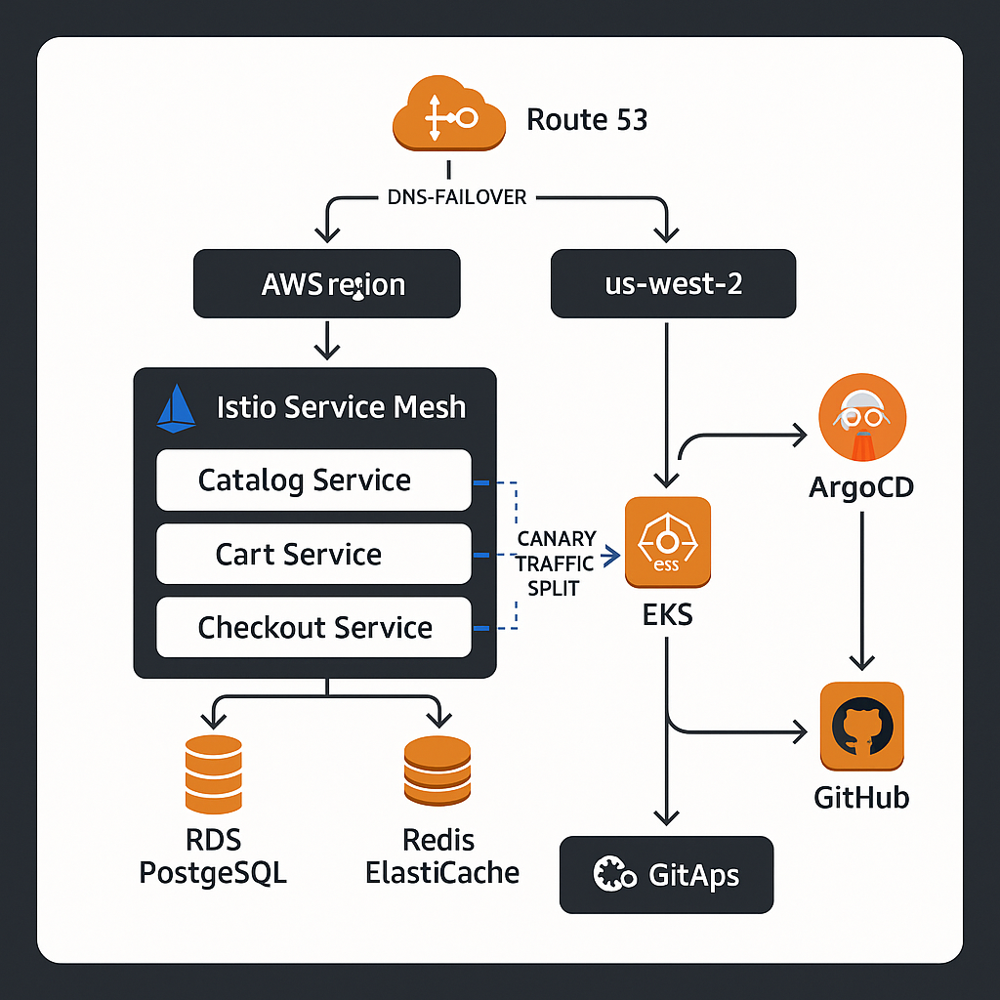

# 🛒 Multi-Region E-Commerce Platform with GitOps


Production-grade multi-region microservices e-commerce platform deployed across **2 AWS regions** on EKS with **GitOps (ArgoCD)**, **Istio service mesh** for canary releases, and **Terraform IaC**.

---

## 🏗 Architecture



## 🔧 Tech Stack

| Tool | Usage |
|------|-------|
| **Terraform** | Provision VPCs, EKS, RDS, ElastiCache, ECR across 2 regions |
| **Docker** | Containerize 3 microservices (catalog, cart, checkout) |
| **Kubernetes (EKS)** | Orchestrate workloads across 2 regions |
| **Helm** | Package ArgoCD and Istio deployments |
| **ArgoCD** | GitOps-driven continuous deployment |
| **Istio** | Service mesh, canary traffic splitting |
| **GitHub Actions** | CI pipeline: test → build → push to ECR |
| **PostgreSQL (RDS)** | Primary + cross-region read replica |
| **Redis (ElastiCache)** | Session caching and cart state |
| **Route 53** | DNS-based failover between regions |

## 🚀 Quick Start

```bash
# 1. Provision infrastructure
cd terraform/environments/us-east-1 && terraform init && terraform apply

# 2. Install ArgoCD + Istio
helm install argocd helm/argocd/ -n argocd --create-namespace
helm install istio helm/istio/ -n istio-system --create-namespace

# 3. Register apps with ArgoCD
kubectl apply -f k8s/base/catalog/argocd-app.yaml

# 4. Push code → GitHub Actions builds → ArgoCD syncs automatically
git push origin main
```

## 📈 Key Outcomes

| Metric | Result |
|--------|--------|
| Environment provisioning | < 20 minutes via Terraform |
| Deployment frequency | Automated on every merge to main |
| Zero-downtime releases | Istio canary: 90/10 → 50/50 → 100 |
| Cross-region failover | < 60 seconds via Route 53 health checks |

## 📁 Project Structure

```
├── .github/workflows/    # CI pipeline (GitHub Actions)
├── helm/                 # ArgoCD + Istio Helm charts
├── k8s/base/             # Kubernetes manifests (Kustomize)
├── services/             # Microservice source code + Dockerfiles
└── terraform/            # IaC modules (VPC, EKS, RDS)
```

## 📜 License

This project is for portfolio/demonstration purposes.
